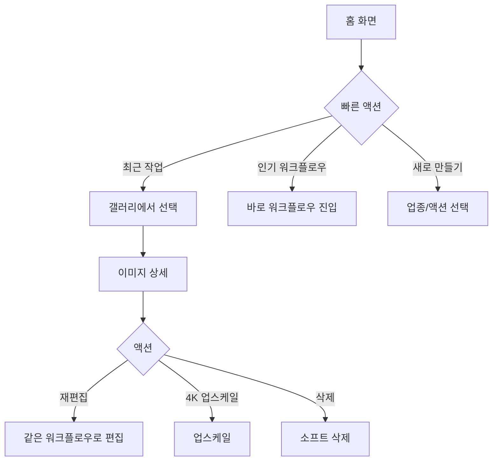
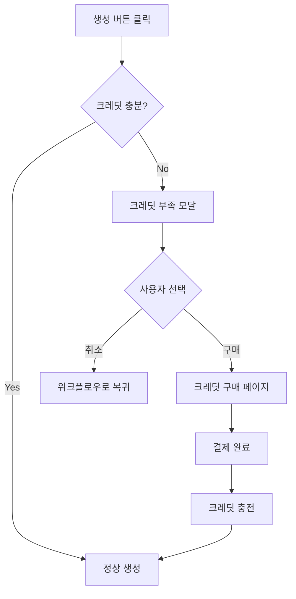

# FlowStudio PRD (Product Requirements Document)

> **버전**: 1.0.0
> **최종 업데이트**: 2026-01-20
> **상태**: Production Ready

---

## 목차

1. [제품 개요](#1-제품-개요)
2. [타겟 사용자 및 시장](#2-타겟-사용자-및-시장)
3. [UX 중심 설계 원칙](#3-ux-중심-설계-원칙)
4. [핵심 기능 정의](#4-핵심-기능-정의)
5. [사용자 여정 및 플로우](#5-사용자-여정-및-플로우)
6. [기술 아키텍처](#6-기술-아키텍처)
7. [데이터 모델](#7-데이터-모델)
8. [수익화 모델](#8-수익화-모델)
9. [성능 요구사항](#9-성능-요구사항)
10. [보안 및 권한](#10-보안-및-권한)
11. [마이그레이션 전략](#11-마이그레이션-전략)
12. [로드맵](#12-로드맵)
13. [성공 지표 (KPIs)](#13-성공-지표-kpis)
14. [부록](#14-부록)

---

## 1. 제품 개요

### 1.1 제품 비전

**FlowStudio**는 한국 이커머스 셀러를 위한 AI 기반 제품 이미지 생성 플랫폼입니다. 전문 스튜디오 촬영 없이도 전문가급 제품 사진과 마케팅 자료를 몇 분 만에 생성할 수 있습니다.

### 1.2 핵심 가치 제안 (Value Proposition)

| 기존 방식 | FlowStudio |
|----------|-----------|
| 스튜디오 촬영 10-50만원/회 | 이미지당 ₩500 (5크레딧) |
| 촬영 예약~납품 3-7일 | 30초 내 결과물 |
| 디자이너 작업 필요 | 셀러 직접 생성 |
| 수정 요청 시 추가 비용 | 무제한 재생성 |
| 색상 옵션별 별도 촬영 | 컬러웨이 자동 변환 (무료) |

### 1.3 핵심 차별점

1. **업종 특화 워크플로우**: 9개 업종 × 95개 맞춤 워크플로우
2. **하이브리드 이미지 처리**: AI + 결정론적 알고리즘으로 비용 최적화
3. **크레딧 기반 과금**: 사용한 만큼만 결제, 초기 진입 장벽 최소화
4. **한글 네이티브 UX**: 100% 한국어, 한국 이커머스 맥락 최적화

---

## 2. 타겟 사용자 및 시장

### 2.1 주요 타겟 사용자

#### Primary Persona: "쿠팡/스마트스토어 셀러"
- **특성**: 월 100-500건 판매, 1인 또는 소규모 팀 운영
- **Pain Point**: 촬영 비용 부담, 색상 옵션별 별도 촬영, 디자이너 의존
- **Goal**: 빠르고 저렴하게 고퀄리티 제품 이미지 확보
- **기술 수준**: 스마트폰/PC 기본 활용 가능

#### Secondary Persona: "자영업 음식점 사장님"
- **특성**: 배달앱 입점, 마케팅 예산 제한적
- **Pain Point**: 메뉴 사진 퀄리티 낮음, SNS 콘텐츠 제작 어려움
- **Goal**: 배달앱 썸네일 퀄리티 향상, 계절 프로모션 이미지 자체 제작

### 2.2 타겟 시장

- **TAM (Total Addressable Market)**: 한국 온라인 셀러 150만+ 명
- **SAM (Serviceable Available Market)**: 제품 이미지 니즈가 있는 셀러 50만+ 명
- **SOM (Serviceable Obtainable Market)**: 연간 목표 사용자 5,000명

---

## 3. UX 중심 설계 원칙

### 3.1 핵심 UX 원칙

#### 원칙 1: "3클릭 내 결과물"
> 홈 → 업종 선택 → 이미지 업로드 → 생성

- 최소한의 단계로 첫 결과물 확인
- 선택적 상세 설정은 접혀있는 형태로 제공
- 모든 필수 입력은 1개 화면에서 완료

#### 원칙 2: "실패 없는 경험"
> 사용자는 절대 막다른 골목에 도달하지 않는다

- 크레딧 부족 시 → 즉시 구매 모달 + 무료 체험 안내
- 이미지 생성 실패 시 → 자동 재시도 + 크레딧 환불
- API 제한 발생 시 → 대체 프로바이더로 자동 전환

#### 원칙 3: "진행 상황 투명성"
> 사용자는 항상 현재 상태를 알 수 있다

- 생성 중 실시간 진행률 표시
- 크레딧 잔액 항상 헤더에 노출
- 만료 예정 크레딧 사전 알림 (7일 전)

#### 원칙 4: "점진적 복잡성"
> 초보자는 단순하게, 전문가는 상세하게

- 기본 옵션으로 즉시 시작 가능
- "고급 설정" 토글로 상세 옵션 노출
- 전문가용 기능은 별도 스튜디오 페이지로 분리

### 3.2 사용자 인터페이스 설계

#### 3.2.1 통합 홈 화면

```
┌─────────────────────────────────────────────────────────┐
│  [FlowStudio 로고]              [크레딧: 100] [프로필] │
├─────────────────────────────────────────────────────────┤
│                                                         │
│        AI로 만드는 전문가급 제품 사진                   │
│        업종을 선택하거나, 원하는 이미지를 설명해주세요  │
│                                                         │
│  ┌───────────────────────────────────────────────────┐  │
│  │ 🔍 어떤 이미지를 만들까요? (예: 흰 배경 티셔츠)   │  │
│  └───────────────────────────────────────────────────┘  │
│                                                         │
│  ┌─────────┬─────────┬─────────┬─────────┬─────────┐   │
│  │   👕    │   🍱    │   💄    │   📱    │   🛋️    │   │
│  │의류/패션│  음식   │  뷰티   │ 전자제품│  가구   │   │
│  └─────────┴─────────┴─────────┴─────────┴─────────┘   │
│                                                         │
│  📈 인기 워크플로우                                     │
│  ┌─────────────┬─────────────┬─────────────┐           │
│  │ 제품 스틸컷 │ 배달앱 썸네일│ 프리미엄컷  │           │
│  └─────────────┴─────────────┴─────────────┘           │
│                                                         │
│  🕐 최근 작업                                           │
│  [이미지 그리드 - 최근 12개]                            │
│                                                         │
└─────────────────────────────────────────────────────────┘
```

#### 3.2.2 워크플로우 위자드

```
┌─────────────────────────────────────────────────────────┐
│  ← 뒤로    의류/패션 > 제품 스틸컷         [1/2 단계]  │
├─────────────────────────────────────────────────────────┤
│                                                         │
│  📸 제품 이미지                                         │
│  ┌─────────────────────────────────────────────┐       │
│  │                                             │       │
│  │     [드래그 앤 드롭 또는 클릭하여 업로드]    │       │
│  │                                             │       │
│  └─────────────────────────────────────────────┘       │
│                                                         │
│  🎨 배경색                                              │
│  ○ 화이트  ● 라이트 그레이  ○ 오프화이트              │
│                                                         │
│  ────────────────────────────────────────────────────   │
│  ▶ 고급 설정 (선택)                                    │
│                                                         │
│  📊 이미지 수: [1] [2] [3] [4]  💰 5 크레딧             │
│                                                         │
│  ┌─────────────────────────────────────────────────┐   │
│  │             [이미지 생성하기]                    │   │
│  └─────────────────────────────────────────────────┘   │
│                                                         │
└─────────────────────────────────────────────────────────┘
```

#### 3.2.3 결과 화면

```
┌─────────────────────────────────────────────────────────┐
│  ✓ 생성 완료                              [새로 만들기] │
├─────────────────────────────────────────────────────────┤
│                                                         │
│  ┌───────────────────┐  ┌───────────────────┐          │
│  │                   │  │                   │          │
│  │    [생성 이미지1]  │  │    [생성 이미지2]  │          │
│  │                   │  │                   │          │
│  │  [선택] [4K업]    │  │  [선택] [4K업]    │          │
│  └───────────────────┘  └───────────────────┘          │
│                                                         │
│  선택한 이미지: 1개                                     │
│                                                         │
│  ┌──────────────┐ ┌──────────────┐ ┌──────────────┐    │
│  │   다운로드    │ │  갤러리 저장  │ │  컬러웨이    │    │
│  └──────────────┘ └──────────────┘ └──────────────┘    │
│                                                         │
└─────────────────────────────────────────────────────────┘
```

### 3.3 반응형 디자인

| 디바이스 | 레이아웃 | 특수 고려사항 |
|---------|---------|-------------|
| Desktop (1280px+) | 2-4 컬럼 그리드 | 사이드바 네비게이션 |
| Tablet (768-1279px) | 2 컬럼 그리드 | 접이식 네비게이션 |
| Mobile (< 768px) | 1 컬럼 스택 | 하단 탭 네비게이션, 터치 최적화 |

### 3.4 접근성 (A11y)

- WCAG 2.1 AA 준수 목표
- 키보드 네비게이션 완전 지원
- 스크린 리더 호환 (aria-label, role 적용)
- 색상 대비 비율 4.5:1 이상
- 포커스 표시 명확하게

---

## 4. 핵심 기능 정의

### 4.1 기능 매트릭스

| 기능 | 설명 | 우선순위 | 상태 |
|-----|------|---------|------|
| 업종별 워크플로우 | 9개 업종 × 95개 액션 | P0 | ✅ 완료 |
| AI 이미지 생성 | Gemini 3 Pro 기반 | P0 | ✅ 완료 |
| 4K 업스케일 | 2K → 4K 고해상도 변환 | P0 | ✅ 완료 |
| 하이브리드 이미지 처리 | 배경 제거, 색상 변환 | P1 | ✅ 완료 |
| 크레딧 시스템 | 사용량 기반 과금 | P0 | ✅ 완료 |
| 구독 플랜 | PLUS/PRO 티어 | P2 | 🔜 예정 |
| 이미지 갤러리 | 저장 및 관리 | P0 | ✅ 완료 |
| 소셜 로그인 | Google/Kakao OAuth | P0 | ✅ 완료 |
| 다국어 지원 | 한국어/영어 | P1 | ✅ 완료 |
| 이미지 처리 스튜디오 | 필터, 색상 전송 | P2 | ✅ 완료 |

### 4.2 업종별 워크플로우 상세

> **총 9개 업종 × 10-12개 액션 = 100개 이상의 맞춤 워크플로우**

#### 4.2.1 의류/패션 (Fashion) - 12개 액션

| 액션 ID | 액션명 | 설명 | 출력 모드 | 사용 예시 |
|--------|-------|------|----------|----------|
| `product_cut` | 제품 스틸컷 | 클린 배경 스튜디오급 제품컷 | EDIT (1:1) | 쿠팡 대표이미지 |
| `flat_lay` | 플랫레이 | 바닥에 펼쳐놓은 구성컷 | EDIT (1:1) | 코디 추천, 세트 상품 |
| `ghost_mannequin` | 고스트 마네킹 | 마네킹 제거 후 입체감 유지 | EDIT (1:1) | 상의/하의 상세컷 |
| `lookbook` | 룩북 | 모델 착용 연출 룩북 | EDIT (4:5) | 인스타그램 피드 |
| `hanger_shot` | 행거샷 | 옷걸이에 걸린 자연스러운 연출 | EDIT (4:5) | 실물 느낌 강조 |
| `colorway` | 컬러웨이 변환 | 색상 옵션 자동 생성 (하이브리드) | EDIT (1:1) | 빨강/파랑/검정 옵션 |
| `detail_zoom` | 디테일 줌 | 봉제선/단추/지퍼 클로즈업 | EDIT (1:1) | 품질 강조 |
| `fabric_texture` | 소재 질감 | 원단 텍스처 확대 | EDIT (1:1) | 면/린넨/폴리 구분 |
| `size_guide` | 사이즈 가이드 | 치수 표시 오버레이 | CREATE (1:1) | 상세페이지 필수 |
| `styling_set` | 스타일링 세트 | 상의+하의+액세서리 조합 | EDIT (1:1) | 코디 제안 |
| `seasonal_mood` | 시즌 무드 | 계절감 배경 (벚꽃/단풍/눈) | EDIT (4:5) | 시즌 프로모션 |
| `detail_section` | 상세페이지 섹션 | 소재/사이즈 강조 세로형 | DETAIL_PAGE (9:16) | 모바일 상세페이지 |

**의류 카테고리별 추천 조합:**
- **티셔츠/맨투맨**: product_cut → colorway → flat_lay → size_guide
- **청바지/슬랙스**: ghost_mannequin → detail_zoom → fabric_texture
- **아우터**: lookbook → hanger_shot → detail_zoom
- **드레스**: lookbook → ghost_mannequin → seasonal_mood

---

#### 4.2.2 음식 (Food) - 11개 액션

| 액션 ID | 액션명 | 설명 | 출력 모드 | 사용 예시 |
|--------|-------|------|----------|----------|
| `delivery_thumbnail` | 배달앱 썸네일 | 윤기/입자감 강조, 식욕 자극 | EDIT (1:1) | 배민/요기요 메뉴 |
| `overhead_shot` | 오버헤드 샷 | 위에서 내려다본 구도 | EDIT (1:1) | 테이블 세팅 전체 |
| `45_degree` | 45도 앵글 | 가장 맛있어 보이는 각도 | EDIT (1:1) | 밥류/면류 추천 |
| `ingredient_hero` | 재료 히어로 | 신선 재료 강조 배치 | EDIT (1:1) | 건강식/샐러드 |
| `steam_effect` | 김 효과 | 따뜻한 음식 김 추가 | EDIT (1:1) | 국밥/찌개/면 |
| `sauce_drizzle` | 소스 드리즐 | 소스 뿌리는 역동적 연출 | EDIT (1:1) | 샐러드/피자/팬케이크 |
| `menu_poster` | 메뉴 포스터 | 텍스트 여백 확보 세로형 | EDIT (9:16) | 매장 포스터 |
| `combo_set` | 세트 메뉴 | 메인+사이드+음료 조합 | EDIT (1:1) | 세트 할인 강조 |
| `seasonal_promo` | 시즌 프로모션 | 계절 무드 반영 (여름/겨울) | EDIT (4:5) | 신메뉴 출시 |
| `takeout_package` | 포장 패키지 | 테이크아웃 용기 연출 | EDIT (1:1) | 배달 전용 메뉴 |
| `sns_story` | SNS 스토리 | 인스타 스토리용 세로형 | CREATE (9:16) | 일일 특가 홍보 |

**음식 카테고리별 추천 조합:**
- **한식 (찌개/탕)**: 45_degree → steam_effect → combo_set
- **양식 (파스타/스테이크)**: overhead_shot → sauce_drizzle → ingredient_hero
- **일식 (초밥/라멘)**: 45_degree → ingredient_hero → steam_effect
- **카페 (디저트/음료)**: overhead_shot → seasonal_promo → sns_story
- **치킨/피자**: delivery_thumbnail → sauce_drizzle → combo_set

---

#### 4.2.3 뷰티 (Beauty) - 11개 액션

| 액션 ID | 액션명 | 설명 | 출력 모드 | 사용 예시 |
|--------|-------|------|----------|----------|
| `premium_studio` | 프리미엄 스튜디오 | 고급 조명/반사 표현 | EDIT (1:1) | 올리브영 대표컷 |
| `texture_swatch` | 텍스처 스와치 | 제형 발색/텍스처 표현 | EDIT (1:1) | 립스틱/파운데이션 |
| `ingredient_story` | 성분 스토리 | 핵심 성분 시각화 (꽃/열매) | EDIT (4:5) | 자연주의 강조 |
| `before_after` | 비포/애프터 | 사용 전후 비교 | CREATE (1:1) | 스킨케어 효과 |
| `model_beauty` | 모델 뷰티샷 | 모델 착용 메이크업 | EDIT (4:5) | 룩북/카탈로그 |
| `dropper_moment` | 드로퍼 모먼트 | 세럼/에센스 떨어지는 순간 | EDIT (1:1) | 세럼류 역동적 연출 |
| `multi_product` | 멀티 제품 | 라인업 전체 구성 | EDIT (1:1) | 세트 상품 |
| `packaging_detail` | 패키징 디테일 | 용기/박스 고급스러움 | EDIT (1:1) | 선물세트 강조 |
| `sns_card` | SNS 카드 | 인스타그램용 카드뉴스 | CREATE (1:1) | 성분/효능 정보 |
| `routine_step` | 루틴 스텝 | 사용 순서 안내 이미지 | CREATE (9:16) | 스킨케어 루틴 |
| `seasonal_edition` | 시즌 에디션 | 한정판/시즌 무드 연출 | EDIT (4:5) | 홀리데이/봄 에디션 |

**뷰티 카테고리별 추천 조합:**
- **스킨케어 (세럼/크림)**: premium_studio → dropper_moment → ingredient_story
- **색조 (립/아이)**: texture_swatch → model_beauty → before_after
- **헤어케어 (샴푸/트리트먼트)**: packaging_detail → ingredient_story → before_after
- **향수**: premium_studio → seasonal_edition → packaging_detail
- **선물세트**: multi_product → packaging_detail → seasonal_edition

---

#### 4.2.4 전자제품 (Electronics) - 11개 액션

| 액션 ID | 액션명 | 설명 | 출력 모드 | 사용 예시 |
|--------|-------|------|----------|----------|
| `product_shot` | 제품 샷 | 금속/유리 질감 표현 | EDIT (1:1) | 쿠팡 대표이미지 |
| `floating_angle` | 플로팅 앵글 | 공중에 띄운 각도 연출 | EDIT (1:1) | 프리미엄 느낌 |
| `interface_glow` | 인터페이스 발광 | 화면/LED 켜진 상태 | EDIT (1:1) | 스마트 기기 |
| `in_use` | 사용 장면 | 실제 사용 환경 연출 | EDIT (16:9) | 라이프스타일컷 |
| `hand_scale` | 손 스케일 | 손으로 크기 비교 | EDIT (1:1) | 휴대용 기기 |
| `unboxing` | 언박싱 | 개봉 구성품 나열 | EDIT (1:1) | 패키지 구성 강조 |
| `port_detail` | 포트 디테일 | 단자/버튼 클로즈업 | EDIT (1:1) | 스펙 상세 |
| `comparison` | 비교컷 | 크기/스펙 비교 이미지 | CREATE (16:9) | 경쟁제품 비교 |
| `workspace_setup` | 워크스페이스 | 데스크 셋업 연출 | EDIT (16:9) | PC/모니터/키보드 |
| `cable_management` | 케이블 정리 | 깔끔한 선정리 연출 | EDIT (16:9) | 홈오피스 무드 |
| `tech_infographic` | 기술 인포그래픽 | 기능 설명 오버레이 | CREATE (9:16) | 상세페이지용 |

**전자제품 카테고리별 추천 조합:**
- **스마트폰/태블릿**: product_shot → floating_angle → interface_glow → hand_scale
- **노트북/모니터**: workspace_setup → interface_glow → port_detail
- **이어폰/헤드폰**: product_shot → in_use → unboxing
- **가전 (청소기/에어컨)**: product_shot → in_use → tech_infographic
- **게이밍 기어**: floating_angle → interface_glow → workspace_setup

---

#### 4.2.5 가구 (Furniture) - 10개 액션

| 액션 ID | 액션명 | 설명 | 출력 모드 | 사용 예시 |
|--------|-------|------|----------|----------|
| `room_setting` | 룸 세팅 | 공간 배치 연출 | EDIT (16:9) | 거실/침실 연출 |
| `white_background` | 화이트 배경 | 깔끔한 누끼 스튜디오컷 | EDIT (1:1) | 쿠팡 대표이미지 |
| `detail_texture` | 디테일/질감 | 소재 클로즈업 | EDIT (1:1) | 원목/패브릭 표현 |
| `multi_angle` | 멀티 앵글 | 정면/측면/후면 조합 | CREATE (16:9) | 360도 뷰 대체 |
| `lifestyle` | 라이프스타일 | 생활 감성 연출 | EDIT (4:5) | 인테리어 무드 |
| `dimension_guide` | 치수 가이드 | 사이즈 표시 오버레이 | CREATE (1:1) | 구매 참고용 |
| `color_options` | 컬러 옵션 | 색상별 변형 (하이브리드) | EDIT (1:1) | 화이트/블랙/우드 |
| `assembly_preview` | 조립 미리보기 | 조립 전후 비교 | CREATE (16:9) | DIY 가구 |
| `small_space` | 작은 공간 | 원룸/소형 공간 배치 | EDIT (16:9) | 1인 가구 타겟 |
| `pet_friendly` | 펫 프렌들리 | 반려동물 함께 연출 | EDIT (4:5) | 펫 가구/용품 |

**가구 카테고리별 추천 조합:**
- **소파/침대**: room_setting → detail_texture → lifestyle → dimension_guide
- **책상/의자**: white_background → multi_angle → small_space
- **수납장/서랍**: room_setting → detail_texture → assembly_preview
- **테이블**: lifestyle → multi_angle → color_options
- **펫 가구**: pet_friendly → white_background → detail_texture

---

#### 4.2.6 인테리어 (Interior) - 10개 액션

| 액션 ID | 액션명 | 설명 | 출력 모드 | 사용 예시 |
|--------|-------|------|----------|----------|
| `mood_change` | 조명/시간대 무드 | 낮/밤/골든아워 변환 | EDIT (16:9) | 분위기 비교 |
| `style_transfer` | 스타일 변환 | 모던/북유럽/빈티지 변경 | EDIT (16:9) | 인테리어 시뮬레이션 |
| `furniture_swap` | 가구 교체 | 기존 가구 → 신제품 교체 | EDIT (16:9) | 가구 배치 미리보기 |
| `wall_color` | 벽면 컬러 | 페인트 색상 변경 (하이브리드) | EDIT (16:9) | 도배/페인트 시뮬 |
| `before_after_reno` | 리노베이션 비포애프터 | 시공 전후 비교 | CREATE (16:9) | 인테리어 업체 |
| `floor_change` | 바닥재 변경 | 타일/원목/대리석 변환 | EDIT (16:9) | 바닥 시공 미리보기 |
| `plant_styling` | 플랜테리어 | 식물 배치 추가 | EDIT (16:9) | 그린 인테리어 |
| `lighting_design` | 조명 디자인 | 조명기구 추가/변경 | EDIT (16:9) | 조명 판매 |
| `curtain_blinds` | 커튼/블라인드 | 창문 스타일링 변경 | EDIT (16:9) | 창가 연출 |
| `seasonal_deco` | 시즌 데코 | 크리스마스/봄/가을 무드 | EDIT (16:9) | 계절 인테리어 |

**인테리어 카테고리별 추천 조합:**
- **전체 리모델링**: style_transfer → wall_color → floor_change → lighting_design
- **가구 배치 상담**: furniture_swap → mood_change → small_space
- **포인트 인테리어**: wall_color → plant_styling → curtain_blinds
- **조명 판매**: lighting_design → mood_change → before_after_reno
- **시즌 연출**: seasonal_deco → plant_styling → mood_change

---

#### 4.2.7 주얼리/액세서리 (Jewelry) - 10개 액션 ✨신규

| 액션 ID | 액션명 | 설명 | 출력 모드 | 사용 예시 |
|--------|-------|------|----------|----------|
| `luxury_studio` | 럭셔리 스튜디오 | 고급 조명/반사 표현 | EDIT (1:1) | 브랜드 대표컷 |
| `on_model` | 모델 착용 | 착용 연출 (손/목/귀) | EDIT (4:5) | 사이즈감 전달 |
| `macro_detail` | 매크로 디테일 | 세공/보석 확대 | EDIT (1:1) | 품질 강조 |
| `lifestyle_flat` | 라이프스타일 플랫 | 소품과 함께 플랫레이 | EDIT (1:1) | 감성 연출 |
| `gift_box` | 기프트 박스 | 케이스/포장 연출 | EDIT (1:1) | 선물용 강조 |
| `material_shine` | 소재 광택 | 골드/실버/로즈골드 | EDIT (1:1) | 소재 옵션 |
| `size_comparison` | 사이즈 비교 | 동전/손가락 대비 | CREATE (1:1) | 크기 참고 |
| `stacking_layer` | 스태킹 레이어 | 중첩 착용 연출 | EDIT (1:1) | 반지/팔찌 |
| `wedding_bridal` | 웨딩/브라이덜 | 결혼 무드 연출 | EDIT (4:5) | 웨딩밴드/커플링 |
| `daily_casual` | 데일리 캐주얼 | 일상 착용 연출 | EDIT (4:5) | 심플한 스타일 |

**주얼리 카테고리별 추천 조합:**
- **반지**: luxury_studio → on_model → macro_detail → size_comparison
- **목걸이/팔찌**: luxury_studio → on_model → stacking_layer
- **귀걸이**: macro_detail → on_model → material_shine
- **웨딩 주얼리**: wedding_bridal → gift_box → macro_detail
- **패션 액세서리**: daily_casual → lifestyle_flat → stacking_layer

---

#### 4.2.8 반려동물 (Pet) - 10개 액션 ✨신규

| 액션 ID | 액션명 | 설명 | 출력 모드 | 사용 예시 |
|--------|-------|------|----------|----------|
| `product_clean` | 제품 클린컷 | 흰 배경 제품 스튜디오 | EDIT (1:1) | 쿠팡 대표이미지 |
| `pet_with_product` | 펫 + 제품 | 반려동물 사용 연출 | EDIT (1:1) | 실제 사용감 |
| `size_with_pet` | 사이즈 비교 | 강아지/고양이 대비 크기 | CREATE (1:1) | 방석/하우스 크기 |
| `ingredient_focus` | 원료 포커스 | 사료 원료 신선함 | EDIT (1:1) | 프리미엄 사료 |
| `nutrition_info` | 영양 정보 | 성분표 시각화 | CREATE (9:16) | 상세페이지용 |
| `cute_moment` | 큐트 모먼트 | 귀여운 순간 포착 연출 | EDIT (4:5) | SNS 바이럴 |
| `multi_pack` | 멀티팩 | 세트/대용량 구성 | EDIT (1:1) | 번들 상품 |
| `outdoor_adventure` | 아웃도어 | 산책/외출 상황 연출 | EDIT (16:9) | 리드/하네스/캐리어 |
| `grooming_before_after` | 그루밍 비포애프터 | 관리 전후 비교 | CREATE (1:1) | 샴푸/브러시 |
| `seasonal_costume` | 시즌 코스튬 | 명절/할로윈 의상 | EDIT (4:5) | 시즌 한정 |

**반려동물 카테고리별 추천 조합:**
- **사료/간식**: product_clean → ingredient_focus → nutrition_info → pet_with_product
- **용품 (방석/하우스)**: product_clean → size_with_pet → pet_with_product
- **의류/액세서리**: cute_moment → seasonal_costume → outdoor_adventure
- **그루밍 용품**: grooming_before_after → product_clean → pet_with_product
- **산책 용품**: outdoor_adventure → size_with_pet → cute_moment

---

#### 4.2.9 유아/아동 (Kids) - 10개 액션 ✨신규

| 액션 ID | 액션명 | 설명 | 출력 모드 | 사용 예시 |
|--------|-------|------|----------|----------|
| `product_safe` | 안전한 제품컷 | 밝고 따뜻한 스튜디오 | EDIT (1:1) | 쿠팡 대표이미지 |
| `in_use_baby` | 사용 장면 | 아이 사용 모습 연출 | EDIT (4:5) | 실사용 느낌 |
| `size_age_guide` | 사이즈/연령 가이드 | 개월수/연령 안내 | CREATE (1:1) | 옷/신발 사이즈 |
| `safety_feature` | 안전 기능 강조 | 안전 인증/기능 표시 | CREATE (9:16) | 상세페이지용 |
| `colorful_playful` | 컬러풀 플레이풀 | 밝고 생동감 있는 연출 | EDIT (1:1) | 완구/문구 |
| `educational` | 교육/발달 | 학습 효과 시각화 | CREATE (9:16) | 교육완구 |
| `gift_package` | 선물 패키지 | 선물용 포장 연출 | EDIT (1:1) | 돌잔치/생일 |
| `mom_baby` | 엄마와 아기 | 엄마+아이 함께 연출 | EDIT (4:5) | 유아용품 신뢰감 |
| `growth_stage` | 성장 단계 | 단계별 사용 연출 | CREATE (16:9) | 분유/이유식 |
| `nursery_setup` | 아이방 세팅 | 아이방 인테리어 배치 | EDIT (16:9) | 아이방 가구 |

**유아/아동 카테고리별 추천 조합:**
- **의류/신발**: product_safe → in_use_baby → size_age_guide → colorful_playful
- **완구/장난감**: colorful_playful → educational → in_use_baby
- **유아용품 (젖병/유모차)**: product_safe → safety_feature → mom_baby
- **이유식/분유**: product_safe → growth_stage → safety_feature
- **아이방 가구**: nursery_setup → safety_feature → colorful_playful

### 4.3 하이브리드 이미지 처리 상세

#### 4.3.1 처리 유형

| 유형 | 기술 | 비용 | 사용 사례 |
|-----|------|-----|----------|
| AI 생성 | Gemini 3 Pro | 5크레딧/장 | 새 이미지 생성, 복잡한 편집 |
| 결정론적 | Canvas API + ONNX | **무료** | 배경 제거, 색상 변환, 필터 |
| 하이브리드 | 전처리 → AI → 후처리 | 5크레딧/장 | 컬러웨이, 무드 변경 |

#### 4.3.2 무료 하이브리드 기능

| 기능 | 기술 | 처리 위치 |
|-----|------|----------|
| 배경 제거 | @imgly/background-removal (ONNX) | 브라우저 (WebGPU) |
| 색상 전송 | Reinhard 알고리즘 (LAB 색공간) | 브라우저 |
| 필터 보정 | Canvas 2D API | 브라우저 |
| 색상 추출 | Canvas getImageData | 브라우저 |
| SAM 영역 선택 | Transformers.js (SlimSAM) | 브라우저 (WebGPU) |

#### 4.3.3 파이프라인 예시: 컬러웨이 변환

```yaml
pipeline:
  preprocessing:
    - type: remove-background
      params:
        model: isnet
        outputFormat: image/png

  processing:
    mode: deterministic
    operations:
      - type: replace-color
        params:
          preserveTexture: true
          tolerance: 30
          intensity: 0.85

  postprocessing:
    - type: composite
      params:
        backgroundColor: "#FFFFFF"

  settings:
    useWorker: true
    useOffscreenCanvas: true
    priority: quality
```

### 4.4 이미지 처리 스튜디오

**접근 경로**: `/color-correction`

#### 4.4.1 탭 구성

| 탭 | 기능 | 기술 |
|----|------|-----|
| 필터 보정 | 밝기, 대비, 채도, 색조 조절 | Canvas 2D filter |
| 색상 추출 | 스포이드로 색상 정보 추출 | getImageData |
| 색상 전송 | Reinhard 알고리즘 색감 전송 | LAB 색공간 변환 |
| 배경 제거 | AI 기반 자동 누끼 | @imgly/background-removal |

#### 4.4.2 프리셋

```typescript
const COLOR_PRESETS = {
  warm: { L: 0, a: 8, b: 15 },      // 따뜻한 톤
  cool: { L: 0, a: -5, b: -10 },    // 차가운 톤
  vintage: { L: -5, a: 5, b: 20 },   // 빈티지
  vivid: { L: 10, a: 15, b: 15 },   // 비비드
  golden: { L: 5, a: 10, b: 25 },   // 골든 아워
  'blue-hour': { L: -10, a: -5, b: -20 }, // 블루 아워
}
```

---

## 5. 사용자 여정 및 플로우

### 5.1 신규 사용자 온보딩 플로우

```mermaid
graph TD
    A[랜딩 페이지 방문] --> B{로그인 여부}
    B -->|미로그인| C[소셜 로그인 선택]
    C --> D[Google/Kakao OAuth]
    D --> E[계정 생성 + 50 무료 크레딧]
    E --> F[통합 홈 화면]
    B -->|로그인됨| F

    F --> G{입력 방식}
    G -->|업종 선택| H[업종 그리드 클릭]
    G -->|빠른 입력| I[QuickInputBar 입력]

    H --> J[액션 선택 모달]
    J --> K[워크플로우 위자드]

    I --> L[의도 분석]
    L --> M[PreviewCard 모달]
    M --> N{수정 여부}
    N -->|수락| K
    N -->|수정| O[옵션 조정]
    O --> K

    K --> P[이미지 업로드]
    P --> Q[옵션 설정]
    Q --> R[생성 버튼]
    R --> S[크레딧 차감 + 생성]
    S --> T[결과 화면]

    T --> U{다음 액션}
    U -->|저장| V[갤러리 저장]
    U -->|4K 업스케일| W[업스케일 + 10크레딧]
    U -->|컬러웨이| X[색상 변환 (무료)]
    U -->|다운로드| Y[이미지 다운로드]
```

### 5.2 재방문 사용자 플로우



### 5.3 크레딧 부족 시 플로우



### 5.4 에러 처리 플로우

```mermaid
graph TD
    A[이미지 생성 요청] --> B{API 호출}
    B -->|성공| C[결과 반환]
    B -->|Rate Limit| D{Fallback 설정?}
    D -->|Yes| E[대체 프로바이더로 재시도]
    D -->|No| F[사용자에게 대기 요청]
    E -->|성공| C
    E -->|실패| G[크레딧 환불 + 에러 안내]
    B -->|네트워크 에러| H[자동 재시도 (3회)]
    H -->|실패| G
    B -->|콘텐츠 정책 위반| I[정책 안내 + 프롬프트 수정 요청]
```

---

## 6. 기술 아키텍처

### 6.1 시스템 아키텍처 개요

```
┌─────────────────────────────────────────────────────────────────┐
│                         Client Layer                            │
│  ┌─────────────────┐  ┌─────────────────┐  ┌─────────────────┐ │
│  │   Next.js 16    │  │  React 19.2     │  │  Tailwind CSS 4 │ │
│  │   App Router    │  │  RSC + Client   │  │  Dark Mode      │ │
│  └────────┬────────┘  └────────┬────────┘  └─────────────────┘ │
│           │                    │                                │
│  ┌────────┴────────────────────┴────────┐                      │
│  │         Browser Image Processing     │                      │
│  │  ┌─────────┐ ┌─────────┐ ┌─────────┐│                      │
│  │  │ Canvas  │ │ WebGPU  │ │  ONNX   ││                      │
│  │  │  2D API │ │ Workers │ │ Runtime ││                      │
│  │  └─────────┘ └─────────┘ └─────────┘│                      │
│  └─────────────────────────────────────┘                      │
└─────────────────────────────────────────────────────────────────┘
                              │
                              ▼
┌─────────────────────────────────────────────────────────────────┐
│                       API Layer (Vercel)                        │
│  ┌─────────────────────────────────────────────────────────┐   │
│  │                  Next.js API Routes                      │   │
│  │  /api/generate  /api/upscale  /api/images/*  /api/auth   │   │
│  └─────────────────────────────────────────────────────────┘   │
│           │                 │                    │              │
│  ┌────────┴─────────────────┴────────────────────┴──────────┐  │
│  │                   Service Layer                          │  │
│  │  ┌───────────┐  ┌───────────┐  ┌───────────┐            │  │
│  │  │ Image     │  │ Credit    │  │ Permission │            │  │
│  │  │ Provider  │  │ Service   │  │ (ReBAC)    │            │  │
│  │  └─────┬─────┘  └─────┬─────┘  └─────┬─────┘            │  │
│  └────────┼──────────────┼──────────────┼──────────────────┘  │
└───────────┼──────────────┼──────────────┼───────────────────────┘
            │              │              │
            ▼              ▼              ▼
┌─────────────────────────────────────────────────────────────────┐
│                      External Services                          │
│  ┌─────────────┐  ┌─────────────┐  ┌─────────────┐             │
│  │ Google GenAI│  │ OpenRouter  │  │  Supabase   │             │
│  │ (Primary)   │  │ (Fallback)  │  │  DB+Storage │             │
│  └─────────────┘  └─────────────┘  └─────────────┘             │
│  ┌─────────────┐  ┌─────────────┐                              │
│  │   PortOne   │  │   OAuth     │                              │
│  │  (Payment)  │  │ (Auth)      │                              │
│  └─────────────┘  └─────────────┘                              │
└─────────────────────────────────────────────────────────────────┘
```

### 6.2 기술 스택 상세

#### Frontend
| 기술 | 버전 | 용도 |
|-----|------|-----|
| Next.js | 16.0.4 | 프레임워크 (App Router) |
| React | 19.2.0 | UI 라이브러리 |
| TypeScript | 5.x | 타입 안전성 |
| Tailwind CSS | 4.x | 스타일링 |
| next-intl | 3.x | 다국어 지원 |
| Lucide React | - | 아이콘 |

#### Backend
| 기술 | 버전 | 용도 |
|-----|------|-----|
| Next.js API Routes | - | API 서버 |
| Prisma | 5.22.0 | ORM |
| NextAuth.js | 4.24.13 | 인증 |

#### Database & Storage
| 기술 | 용도 |
|-----|-----|
| PostgreSQL (Supabase) | 메인 데이터베이스 |
| Supabase Storage | 이미지 파일 저장 |

#### AI & Image Processing
| 기술 | 용도 |
|-----|-----|
| Google GenAI SDK | AI 이미지 생성 |
| OpenRouter API | 대체 프로바이더 |
| @imgly/background-removal | 배경 제거 |
| Transformers.js | SAM 세그멘테이션 |
| Canvas 2D API | 필터/색상 처리 |

### 6.3 다중 프로바이더 전략

#### 6.3.1 프로바이더 선택 로직

```typescript
// lib/imageProvider.ts

type ProviderStrategy = 'google' | 'openrouter' | 'hybrid';

function selectProviderForBatch(batchCount: number): 'google' | 'openrouter' {
  const strategy = getProviderStrategy();
  const threshold = getHybridThreshold(); // 기본값: 2

  switch (strategy) {
    case 'google':
      return 'google';
    case 'openrouter':
      return 'openrouter';
    case 'hybrid':
      return batchCount >= threshold ? 'openrouter' : 'google';
  }
}
```

#### 6.3.2 Fallback 메커니즘

```typescript
async function generateWithFallback(prompt: string, options: GenerateOptions) {
  const primaryProvider = selectProviderForBatch(options.count);

  try {
    return await generateImage(primaryProvider, prompt, options);
  } catch (error) {
    if (isRateLimitError(error) && isFallbackEnabled()) {
      const fallbackProvider = primaryProvider === 'google' ? 'openrouter' : 'google';
      return await generateImage(fallbackProvider, prompt, options);
    }
    throw error;
  }
}
```

### 6.4 브라우저 이미지 처리 아키텍처

```
┌─────────────────────────────────────────────────────────────┐
│                    Main Thread                              │
│  ┌─────────────────────────────────────────────────────┐   │
│  │              React Components                        │   │
│  │  ColorTransferTool, BackgroundRemovalPreview, etc.  │   │
│  └───────────────────────┬─────────────────────────────┘   │
│                          │                                  │
│                          ▼                                  │
│  ┌─────────────────────────────────────────────────────┐   │
│  │           lib/imageProcessing/index.ts              │   │
│  │  processImage(), applyColorTransfer(), etc.         │   │
│  └───────────────────────┬─────────────────────────────┘   │
└──────────────────────────┼──────────────────────────────────┘
                           │
           ┌───────────────┼───────────────┐
           ▼               ▼               ▼
┌─────────────────┐ ┌─────────────────┐ ┌─────────────────┐
│   Web Worker    │ │  OffscreenCanvas│ │    WebGPU       │
│  (Heavy Ops)    │ │  (Rendering)    │ │  (ONNX/SAM)     │
│                 │ │                 │ │                 │
│ - Reinhard 알고리즘│ - 필터 적용    │ - 배경 제거       │
│ - 색상 변환      │ - 이미지 합성    │ - 세그멘테이션    │
└─────────────────┘ └─────────────────┘ └─────────────────┘
```

---

## 7. 데이터 모델

### 7.1 핵심 엔티티 관계도

```
┌─────────────┐     ┌─────────────┐     ┌─────────────┐
│    User     │────<│  Account    │     │   Session   │
│             │     │ (OAuth)     │     │             │
└──────┬──────┘     └─────────────┘     └─────────────┘
       │
       │ 1:N
       ▼
┌─────────────┐     ┌─────────────┐     ┌─────────────┐
│ImageProject │────<│ Workflow    │     │ Generation  │
│             │     │ Session     │     │ History     │
└──────┬──────┘     └─────────────┘     └─────────────┘
       │
       │ ReBAC
       ▼
┌─────────────┐     ┌─────────────┐
│RelationTuple│     │ Relation    │
│ (권한)       │     │ Definition  │
└─────────────┘     └─────────────┘

┌─────────────┐     ┌─────────────┐     ┌─────────────┐
│   Credit    │────<│ Credit      │     │ Credit      │
│ (잔액)       │     │ Transaction │     │ Ledger      │
└─────────────┘     └─────────────┘     └─────────────┘

┌─────────────┐
│ Referral    │
│ (추천)      │
└─────────────┘
```

### 7.2 주요 모델 상세

#### 7.2.1 User
```prisma
model User {
  id                   String    @id @default(cuid())
  name                 String?
  email                String?   @unique
  image                String?

  // 비즈니스 인증
  businessNumber       String?   @unique
  businessVerified     Boolean   @default(false)

  // 추천 시스템
  referralCode         String?   @unique
  referredBy           String?

  // 크레딧 (비정규화)
  creditBalance        Int       @default(0)

  // Relations
  imageProjects        ImageProject[]
  credit               Credit?
}
```

#### 7.2.2 ImageProject
```prisma
model ImageProject {
  id           String   @id @default(cuid())
  userId       String
  title        String
  mode         String   // 'CREATE', 'EDIT', 'DETAIL_PAGE', etc.

  // 생성 파라미터
  prompt       String?  @db.Text
  aspectRatio  String?  @default("1:1")

  // 이미지 데이터 (Supabase Storage URLs)
  sourceImage  String?  @db.Text
  resultImages String[] @default([])

  // 워크플로우 연결
  workflowId   String?
  industryId   String?
  actionId     String?

  // 상태
  status       String   @default("draft")
  deletedAt    DateTime?
}
```

#### 7.2.3 Credit 시스템
```prisma
model Credit {
  id        String @id @default(cuid())
  userId    String @unique
  balance   Int    @default(0)  // 1 크레딧 = ₩100
}

model CreditTransaction {
  id              String    @id @default(cuid())
  userId          String
  amount          Int       // 양수: 충전, 음수: 사용
  remainingAmount Int?      // 남은 크레딧 (FIFO 차감용)
  type            String    // 'PURCHASE', 'BONUS', 'GENERATION', 'UPSCALE'
  expiresAt       DateTime? // 무료 크레딧: 30일 만료
}

model CreditLedger {
  id                String   @id @default(cuid())
  userId            String
  workflowSessionId String?
  requestId         String   @unique  // 멱등성 키

  holdAmount        Int      // 예약된 크레딧
  capturedAmount    Int?     // 실제 차감된 크레딧
  refundedAmount    Int?     // 환불된 크레딧

  status            String   @default("HELD")  // 'HELD', 'CAPTURED', 'REFUNDED'
}
```

### 7.3 ReBAC 권한 시스템

#### 7.3.1 권한 구조
```
namespace: image_project
  relations:
    - owner (inherits: editor, viewer)
    - editor (inherits: viewer)
    - viewer

namespace: system
  relations:
    - admin (전역 관리자)
```

#### 7.3.2 권한 체크 패턴
```typescript
// 조회 권한 확인
const canView = await check(userId, 'image_project', projectId, 'viewer');

// 편집 권한 확인
const canEdit = await check(userId, 'image_project', projectId, 'editor');

// 관리자 권한 확인 (non-throwing)
if (await isAdmin(userId)) {
  // 관리자 전용 기능
}

// API 라우트 보호 (throwing)
await requireImageProjectEditor(userId, projectId);
```

---

## 8. 수익화 모델

### 8.1 크레딧 시스템

#### 8.1.1 크레딧 가격표

| 크레딧 수량 | 가격 | 단가 | 비고 |
|-----------|------|-----|------|
| 50 | 무료 | - | 신규 가입 보너스 |
| 100 | ₩10,000 | ₩100/크레딧 | 체험팩 |
| 300 | ₩28,000 | ₩93/크레딧 | 7% 할인 |
| 1,000 | ₩90,000 | ₩90/크레딧 | 10% 할인 |
| 3,000 | ₩250,000 | ₩83/크레딧 | 17% 할인 |

#### 8.1.2 크레딧 소비

| 기능 | 크레딧 | 비고 |
|-----|-------|-----|
| 2K 이미지 생성 | 5 | 1장 기준 |
| 4K 업스케일 | 10 | 1장 기준 |
| 배경 제거 | 0 | 무료 (브라우저 처리) |
| 색상 전송 | 0 | 무료 (브라우저 처리) |
| 필터 보정 | 0 | 무료 (브라우저 처리) |

#### 8.1.3 크레딧 만료 정책

| 크레딧 유형 | 만료 기간 | 비고 |
|-----------|---------|------|
| 가입 보너스 | 30일 | FIFO 우선 차감 |
| 추천 보너스 | 30일 | FIFO 우선 차감 |
| 사업자 보너스 | 90일 | 인증 시 지급 |
| 구매 크레딧 | 무기한 | 만료 없음 |

### 8.2 추천 보너스

| 이벤트 | 추천인 보너스 | 피추천인 보너스 |
|-------|------------|--------------|
| 가입 완료 | - | 50 크레딧 |
| 첫 결제 완료 | 100 크레딧 | - |

---

## 9. 성능 요구사항

### 9.1 응답 시간 목표

| 작업 | 목표 | 최대 허용 |
|-----|------|---------|
| 페이지 로드 (LCP) | < 2.5초 | 4초 |
| 이미지 생성 (1장) | < 15초 | 30초 |
| 이미지 생성 (4장) | < 30초 | 60초 |
| 4K 업스케일 | < 20초 | 40초 |
| 배경 제거 (브라우저) | < 5초 | 15초 |
| 색상 전송 (브라우저) | < 1초 | 3초 |

### 9.2 확장성 요구사항

| 지표 | 현재 용량 | 목표 용량 |
|-----|---------|---------|
| 동시 사용자 | 100 | 1,000 |
| 일일 이미지 생성 | 1,000장 | 50,000장 |
| 데이터베이스 쿼리 | 100 QPS | 1,000 QPS |
| 이미지 저장소 | 100GB | 10TB |

### 9.3 가용성 목표

- **SLA 목표**: 99.5% 가동률
- **계획된 다운타임**: 월 4시간 이내
- **RTO (Recovery Time Objective)**: 1시간
- **RPO (Recovery Point Objective)**: 1시간

### 9.4 최적화 전략

#### 9.4.1 프론트엔드
- Intersection Observer 기반 이미지 지연 로딩 (`LazyImage`)
- 스켈레톤 UI로 체감 로딩 시간 단축
- 동적 임포트로 번들 사이즈 최적화
- Web Worker로 이미지 처리 메인 스레드 분리

#### 9.4.2 백엔드
- Prisma 연결 풀링 (DATABASE_URL)
- 이미지 URL만 DB 저장 (base64 → Supabase Storage)
- Promise.allSettled로 병렬 이미지 생성
- Rate limit 감지 시 자동 프로바이더 전환

---

## 10. 보안 및 권한

### 10.1 인증

| 방식 | 용도 |
|-----|-----|
| Google OAuth 2.0 | 소셜 로그인 (주요) |
| Kakao OAuth | 소셜 로그인 (한국) |
| NextAuth.js | 세션 관리 |
| JWT | API 인증 토큰 |

### 10.2 권한 (Authorization)

| 레벨 | 설명 | 구현 |
|-----|------|-----|
| 리소스 | 프로젝트별 접근 권한 | ReBAC (owner/editor/viewer) |
| API | 엔드포인트별 권한 | require* 미들웨어 |
| 시스템 | 관리자 권한 | isAdmin() 체크 |

### 10.3 데이터 보안

| 항목 | 보호 방식 |
|-----|----------|
| API 키 | 서버 측 중앙화 (사용자 키 폐기) |
| 세션 | HTTP-only 쿠키, CSRF 토큰 |
| 이미지 | Supabase RLS 정책 |
| 통신 | HTTPS 전용 |

### 10.4 보안 체크리스트

- [x] SQL Injection 방지 (Prisma ORM)
- [x] XSS 방지 (React 자동 이스케이프)
- [x] CSRF 방지 (NextAuth)
- [x] Rate Limiting (Vercel Edge)
- [x] 민감 정보 환경 변수 분리
- [ ] 웹훅 서명 검증 (PortOne)
- [ ] Content Security Policy 헤더

---

## 11. 마이그레이션 전략

### 11.1 기존 시스템에서의 마이그레이션

#### 11.1.1 사용자 데이터 마이그레이션

기존 Vite 앱에서 Next.js로 마이그레이션 시 사용자 데이터 처리:

| 데이터 | 마이그레이션 방식 | 상태 |
|-------|----------------|------|
| 사용자 계정 | OAuth 재인증 (기존 email 매칭) | ✅ 완료 |
| API 키 | 폐기 (Vertex AI 전환) | ✅ 완료 |
| 이미지 (base64) | Supabase Storage URL로 변환 | ✅ 완료 |
| 크레딧 잔액 | 그대로 유지 | ✅ 완료 |

#### 11.1.2 이미지 저장소 마이그레이션

**Phase 5에서 완료된 마이그레이션:**

```typescript
// 마이그레이션 스크립트 예시
async function migrateImageToStorage(project: ImageProject) {
  // 1. base64 이미지 추출
  const base64Images = project.resultImages.filter(img => img.startsWith('data:'));

  // 2. Supabase Storage 업로드
  const uploadedUrls = await Promise.all(
    base64Images.map(async (base64, index) => {
      const { data, error } = await supabase.storage
        .from('flowstudio-images')
        .upload(`${project.userId}/${project.id}/${index}.png`, base64ToBuffer(base64));

      return supabase.storage
        .from('flowstudio-images')
        .getPublicUrl(data.path).data.publicUrl;
    })
  );

  // 3. DB 업데이트
  await prisma.imageProject.update({
    where: { id: project.id },
    data: { resultImages: uploadedUrls }
  });
}
```

#### 11.1.3 권한 마이그레이션

기존 프로젝트에 ReBAC 권한이 없는 경우를 위한 후방 호환성:

```typescript
// /api/images/list/route.ts
async function listUserImages(userId: string) {
  // 1. ReBAC 권한으로 조회 시도
  let accessibleIds = await listAccessible(userId, 'image_project', 'viewer');

  // 2. 권한이 없으면 userId 기반 fallback
  if (accessibleIds.length === 0) {
    const userProjects = await prisma.imageProject.findMany({
      where: { userId, deletedAt: null },
      select: { id: true }
    });
    accessibleIds = userProjects.map(p => p.id);
  }

  return prisma.imageProject.findMany({
    where: { id: { in: accessibleIds } }
  });
}
```

**권한 일괄 마이그레이션 스크립트:**

```bash
# 기존 프로젝트에 owner 권한 일괄 부여
npx tsx scripts/migrate-project-permissions.ts
```

```typescript
// scripts/migrate-project-permissions.ts
async function migrateProjectPermissions() {
  const projects = await prisma.imageProject.findMany({
    where: { deletedAt: null }
  });

  for (const project of projects) {
    const hasPermission = await check(project.userId, 'image_project', project.id, 'owner');
    if (!hasPermission) {
      await grantImageProjectOwnership(project.id, project.userId);
      console.log(`Granted owner permission for project ${project.id}`);
    }
  }
}
```

### 11.2 환경 마이그레이션

#### 11.2.1 API 키 → Vertex AI 전환 (Phase 6)

**Before (사용자 개별 API 키):**
```typescript
// 사용자가 직접 API 키 입력 필요
const apiKey = await getDecryptedApiKey(userId);
const genAI = new GoogleGenerativeAI(apiKey);
```

**After (중앙화된 인증):**
```typescript
// 서버 측 중앙화된 인증
const genAI = getGenAIClient(); // 환경 변수 기반 자동 설정
```

#### 11.2.2 데이터베이스 마이그레이션

Prisma 마이그레이션 워크플로우:

```bash
# 1. 스키마 변경
# prisma/schema.prisma 편집

# 2. 마이그레이션 생성 및 적용
npx prisma migrate dev --name add_workflow_fields

# 3. 프로덕션 배포 시
npx prisma migrate deploy
```

### 11.3 롤백 전략

| 시나리오 | 롤백 방법 |
|---------|----------|
| 코드 배포 실패 | Vercel 이전 버전으로 롤백 |
| DB 마이그레이션 실패 | Prisma migrate down |
| 이미지 저장소 이슈 | base64 fallback 유지 (30일) |
| API 프로바이더 장애 | 자동 fallback 프로바이더 |

---

## 12. 로드맵

### 12.1 완료된 Phase (v1.0)

| Phase | 주요 기능 | 상태 |
|-------|---------|------|
| 1 | 보안 강화 (API 키 서버 측 저장) | ✅ |
| 2 | 권한 시스템 개선 (ReBAC) | ✅ |
| 3 | 네비게이션 현대화 | ✅ |
| 4 | 타입 안전성 & 에러 핸들링 | ✅ |
| 5 | 이미지 저장소 (Supabase Storage) | ✅ |
| 6 | Vertex AI 전환 (듀얼 모드) | ✅ |
| 7 | ReBAC 후방 호환성 | ✅ |
| 8 | 수익화 기능 (크레딧 시스템) | ✅ |
| 9 | 성능 최적화 (스켈레톤, LazyImage) | ✅ |
| 10 | 다중 프로바이더 (Hybrid) | ✅ |

### 12.2 v1.1 계획 (Q1 2026)

| 기능 | 설명 | 우선순위 |
|-----|------|---------|
| 실시간 협업 | WebSocket 기반 동시 편집 | P2 |
| 템플릿 마켓플레이스 | 사용자 프롬프트 템플릿 공유 | P2 |
| API 외부 제공 | B2B API 서비스 | P3 |
| 모바일 앱 | React Native 앱 | P3 |

### 12.3 v2.0 비전 (2026 H2)

- **AI 에이전트**: 대화형 이미지 편집 ("이 배경 좀 더 밝게")
- **비디오 지원**: 제품 회전 동영상 생성
- **AR 미리보기**: 실제 공간에 제품 배치 미리보기
- **엔터프라이즈**: 팀 워크스페이스, SSO, 감사 로그

---

## 13. 성공 지표 (KPIs)

### 13.1 사용자 지표

| 지표 | 정의 | 목표 (월간) |
|-----|------|-----------|
| MAU | 월간 활성 사용자 | 5,000 |
| WAU | 주간 활성 사용자 | 2,000 |
| DAU | 일간 활성 사용자 | 500 |
| Retention (D7) | 7일 후 재방문율 | 40% |
| Retention (D30) | 30일 후 재방문율 | 25% |

### 13.2 제품 지표

| 지표 | 정의 | 목표 |
|-----|------|-----|
| 이미지 생성 수 | 일간 생성 이미지 | 10,000장 |
| 생성 성공률 | 성공/전체 생성 시도 | 98% |
| 평균 생성 시간 | 요청~결과 시간 | < 15초 |
| 4K 업스케일 비율 | 업스케일/전체 생성 | 20% |
| 무료 기능 사용률 | 배경 제거/색상 전송 | 30% |

### 13.3 비즈니스 지표

| 지표 | 정의 | 목표 (월간) |
|-----|------|-----------|
| MRR | 월간 반복 수익 | ₩50,000,000 |
| ARPU | 사용자당 평균 수익 | ₩10,000 |
| 유료 전환율 | 무료→유료 전환 | 5% |
| Churn Rate | 월간 이탈률 | < 5% |
| NPS | 순추천지수 | > 50 |

### 13.4 기술 지표

| 지표 | 정의 | 목표 |
|-----|------|-----|
| 가동률 | 서비스 가용성 | 99.5% |
| P95 응답시간 | 95% 요청 응답시간 | < 500ms |
| 에러율 | 5xx 에러 비율 | < 0.1% |
| API 성공률 | AI API 호출 성공률 | 99% |

---

## 14. 부록

### 14.1 용어 정의

| 용어 | 정의 |
|-----|------|
| 워크플로우 | 업종+액션 조합으로 정의된 이미지 생성 파이프라인 |
| 액션 | 워크플로우 내 특정 이미지 생성 작업 (예: 제품 스틸컷) |
| 하이브리드 처리 | AI + 결정론적 알고리즘 조합 이미지 처리 |
| 크레딧 | 서비스 사용 단위 (1 크레딧 = ₩100) |
| ReBAC | Relationship-Based Access Control, 관계 기반 권한 시스템 |
| 업스케일 | 2K → 4K 고해상도 변환 |
| 컬러웨이 | 동일 제품의 다양한 색상 옵션 이미지 |

### 14.2 API 엔드포인트 목록

| 엔드포인트 | 메소드 | 설명 |
|-----------|-------|------|
| `/api/generate` | POST | AI 이미지 생성 |
| `/api/upscale` | POST | 4K 업스케일 |
| `/api/images/save` | POST | 이미지 저장 |
| `/api/images/list` | GET | 이미지 목록 조회 |
| `/api/images/[id]` | GET/DELETE | 이미지 상세/삭제 |
| `/api/projects/*` | CRUD | 프로젝트 관리 |
| `/api/credits/balance` | GET | 크레딧 잔액 조회 |
| `/api/credits/history` | GET | 크레딧 내역 조회 |
| `/api/workflows/session` | POST/PUT | 워크플로우 세션 관리 |
| `/api/analyze-intent` | POST | 프롬프트 의도 분석 |

### 14.3 환경 변수 체크리스트

```bash
# 필수 (Production)
DATABASE_URL=
DIRECT_URL=
NEXT_PUBLIC_SUPABASE_URL=
SUPABASE_SERVICE_ROLE_KEY=
NEXTAUTH_URL=
NEXTAUTH_SECRET=
GOOGLE_CLIENT_ID=
GOOGLE_CLIENT_SECRET=
GOOGLE_API_KEY=                    # Google AI Studio 모드
IMAGE_PROVIDER=                    # google | openrouter | hybrid

# 선택 (Feature Flags)
KAKAO_CLIENT_ID=
KAKAO_CLIENT_SECRET=
GOOGLE_GENAI_USE_VERTEXAI=         # true | false
GOOGLE_CLOUD_PROJECT=              # Vertex AI 모드
GOOGLE_CLOUD_LOCATION=             # Vertex AI 모드
OPENROUTER_API_KEY=                # OpenRouter 사용 시
IMAGE_HYBRID_THRESHOLD=            # hybrid 모드 임계값
IMAGE_FALLBACK_ENABLED=            # fallback 활성화
PORTONE_WEBHOOK_SECRET=            # 결제 웹훅
```

### 14.4 참고 문서

- [CLAUDE.md](/CLAUDE.md) - 개발자 가이드
- [docs/HYBRID_IMAGE_PROCESSING_USAGE.md](/docs/HYBRID_IMAGE_PROCESSING_USAGE.md) - 하이브리드 처리 사용법
- [lib/workflow/workflowSchema.json](/lib/workflow/workflowSchema.json) - 워크플로우 스키마

---

**문서 작성**: Claude Code
**최종 검토**: 2026-01-20
**다음 업데이트 예정**: v1.1 릴리즈 시
